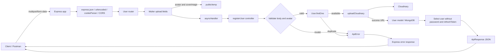
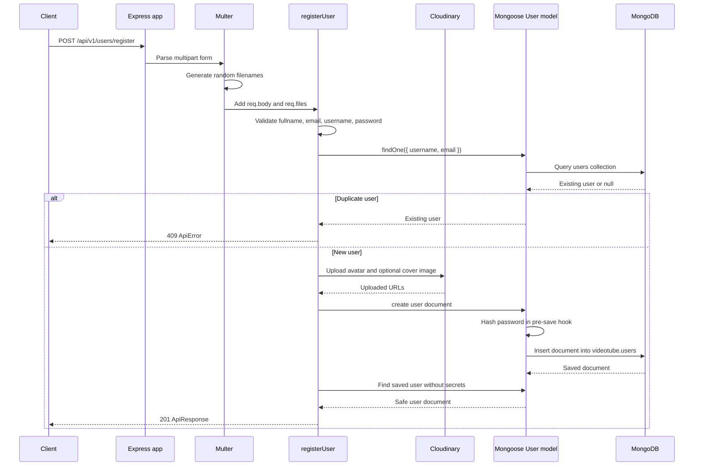
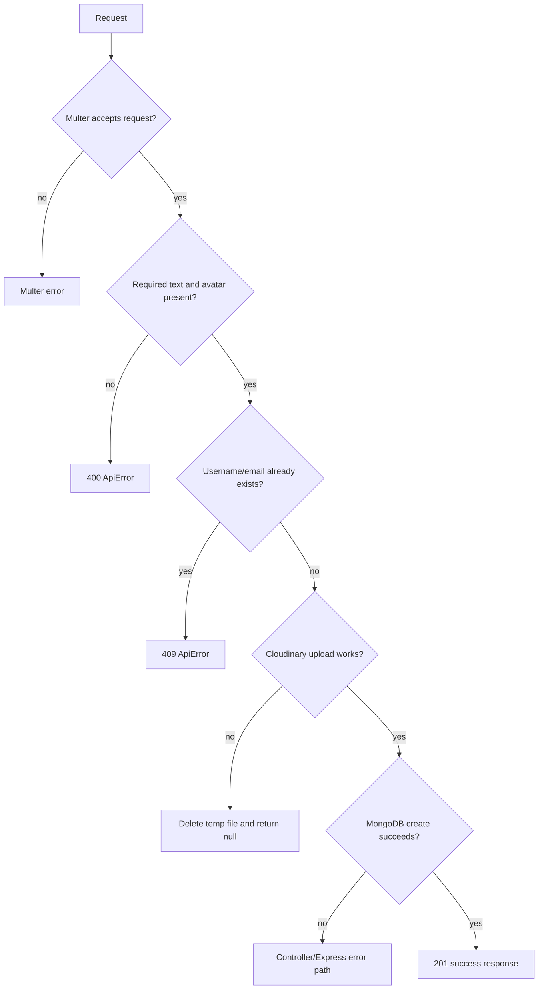

# Chai Aur Backend — Architecture

This document shows how the project is organized today and how a user-registration request travels through the application.

For the standalone visual version, see [`ARCHITECTURE_DIAGRAM.md`](./ARCHITECTURE_DIAGRAM.md). It contains the system, component, startup, registration, data-flow, and error-path diagrams.

## 1. File-based architecture

```text
chai aur backend/
├── .env                              # Local configuration and secrets; do not commit
├── .gitignore                        # Files excluded from Git
├── package.json                      # Scripts and dependencies
├── package-lock.json                 # Locked dependency versions
├── Readme.md                         # Learning guide and current behavior
├── BACKEND_GUIDE.md                  # Earlier setup notes
├── ARCHITECTURE.md                   # This architecture and request-flow document
├── public/
│   └── temp/                         # Temporary files saved by Multer
└── src/
    ├── index.js                      # Process entry point and server startup
    ├── app.js                        # Express app, global middleware, route mounting
    ├── constants.js                  # Shared values, including database name
    ├── db/
    │   └── index.js                  # Mongoose connection function
    ├── routes/
    │   └── user.routes.js            # User URL → middleware → controller mapping
    ├── controllers/
    │   └── user.controller.js        # Registration business logic
    ├── middlewares/
    │   └── multer.middleware.js      # Multipart file upload handling
    ├── models/
    │   ├── user.model.js             # User schema, password hashing, JWT methods
    │   └── video.model.js            # Planned video schema/model
    └── utils/
        ├── asyncHandler.js           # Forwards rejected controller Promises
        ├── apiError.js               # Custom application error shape
        ├── apiResponse.js            # Standard success response shape
        └── cloudinary.js             # Uploads local files to Cloudinary
```

## 2. Startup flow

```mermaid
flowchart TD
    A[Run npm run dev] --> B[nodemon starts src/index.js]
    B --> C[dotenv loads .env]
    C --> D[Import app from src/app.js]
    D --> E[Express app is created]
    E --> F[Global middleware is registered]
    F --> G[User router mounted at /api/v1/users]
    G --> H[Import connectDb from src/db/index.js]
    H --> I[Read DB_NAME from src/constants.js]
    I --> J[Connect to MONGODB_URL/videotube]
    J -->|success| K[app.listen(PORT or 8000)]
    J -->|failure| L[Log error and exit process]
```

### Startup responsibilities

| File               | Responsibility                                                         |
| ------------------ | ---------------------------------------------------------------------- |
| `src/index.js`     | Loads configuration, connects to MongoDB, then starts the HTTP server. |
| `src/app.js`       | Builds the Express application and mounts middleware/routes.           |
| `src/db/index.js`  | Creates the Mongoose connection using `MONGODB_URL` and `DB_NAME`.     |
| `src/constants.js` | Keeps the application database name as `videotube`.                    |

## 3. Registration request flow

Endpoint:

```text
POST /api/v1/users/register
Content-Type: multipart/form-data
```

Expected fields:

- Text: `fullname`, `email`, `username`, `password`
- File: `avatar` — required, maximum one file
- File: `coverImage` — optional, maximum one file



## 4. Registration sequence, step by step



## 5. What each layer does

### `app.js`

Creates the Express application and installs cross-cutting middleware:

1. CORS policy
2. JSON body parsing
3. URL-encoded body parsing
4. Static files from `public/`
5. Cookie parsing
6. User routes under `/api/v1/users`

### `user.routes.js`

Defines the registration route:

```text
POST /api/v1/users/register
  → upload.fields(...)
  → registerUser
```

Routes should stay focused on matching URLs and arranging middleware. They should not contain database business logic.

### `multer.middleware.js`

Multer handles `multipart/form-data`, which is needed when text fields and files are sent together. It:

1. Saves files to `public/temp`.
2. Accepts one `avatar` and one `coverImage`.
3. Uses `node:crypto.randomBytes` to create unique filenames.
4. Makes files available through `req.files`.

### `user.controller.js`

The controller coordinates registration:

1. Reads text fields from `req.body`.
2. Reads file paths safely from `req.files`.
3. Rejects incomplete requests.
4. Checks for an existing username or email.
5. Uploads local files to Cloudinary.
6. Creates a `User` document.
7. Returns the created user without `password` and `refreshToken`.

### `user.model.js`

Defines the Mongoose `User` schema. The model name `User` is normally mapped by Mongoose to the MongoDB collection `users`.

The pre-save hook hashes a password only when it is new or modified. This means the database should never receive the plain-text password from the controller.

### `cloudinary.js`

Configures Cloudinary from environment variables and uploads local files. After upload, the local temporary file is deleted.

### `asyncHandler.js`

Wraps an async controller and forwards rejected Promises to Express's `next` function instead of requiring repetitive `try/catch` blocks in every controller.

## 6. Data destinations

```text
Uploaded request files
        │
        ▼
public/temp/avatar-<random hex>
public/temp/coverImage-<random hex>
        │
        │ uploadCloudinary()
        ▼
Cloudinary URLs stored in MongoDB
        │
        ▼
MongoDB database: videotube
MongoDB collection: users
```

The saved user document contains URLs, not the local temporary file contents.

## 7. Error paths



## 8. Current implementation notes

These are worth fixing or keeping in mind while learning:

1. `src/utils/cloudinary.js` currently contains a top-level test upload of `https://someting`. It runs whenever the module is imported and should be removed; tests should not run as a side effect of importing production code.
2. `src/models/video.model.js` uses `Schema.Types.ObjectId` without importing `Schema`. It is not used by the current registration route, but it will fail when that model is imported.
3. `src/utils/cloudinary.js` calls `fs.unlinkSync(localFilePath)` in the catch path without checking whether the path still exists. A safer cleanup should check the file first or use a guarded asynchronous removal.
4. The controller currently logs request data while learning. Avoid logging passwords or other sensitive values in real applications.
5. `src/index.js` imports `mongoose` and `DB_NAME` for an old commented approach. They can be removed once that learning example is no longer needed.
6. The `.env` file contains secrets and must remain uncommitted. Rotate credentials if they have been shared.

## 9. Learning rule of thumb

For a new feature, follow this chain:

```text
model → controller → route → app mount → client request → database response
```

Add one small feature vertically instead of building an entire layer in isolation. This makes it easier to see how a request moves through the backend.
